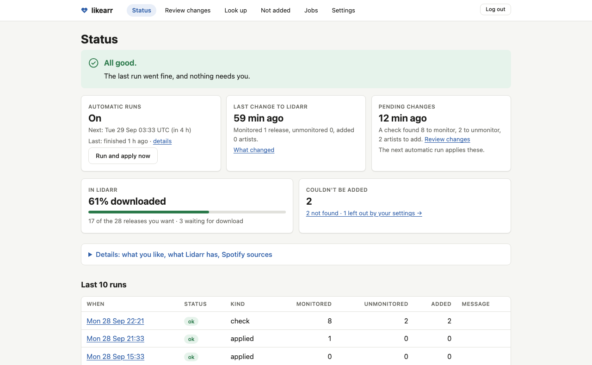
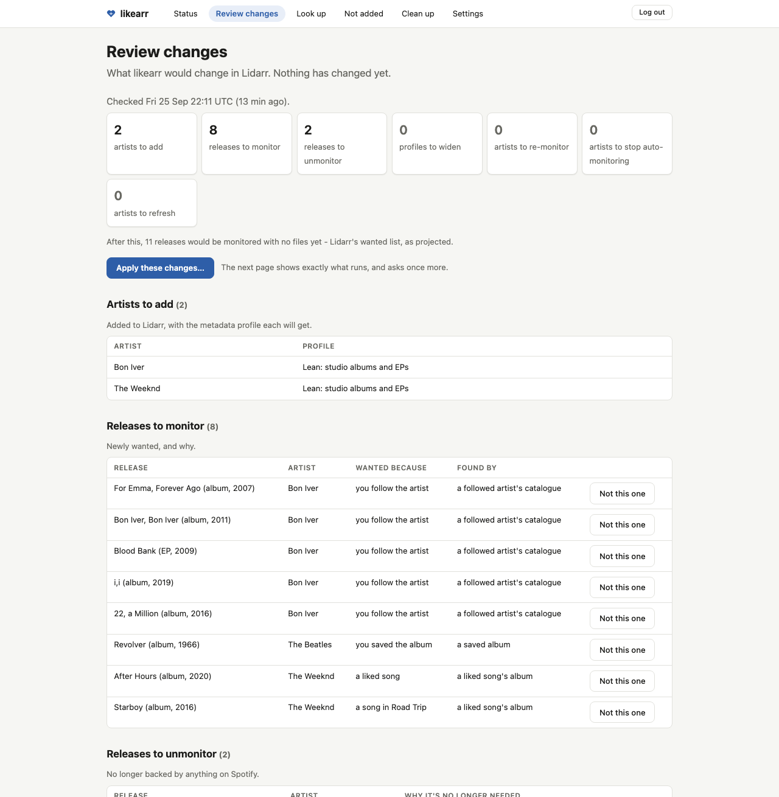
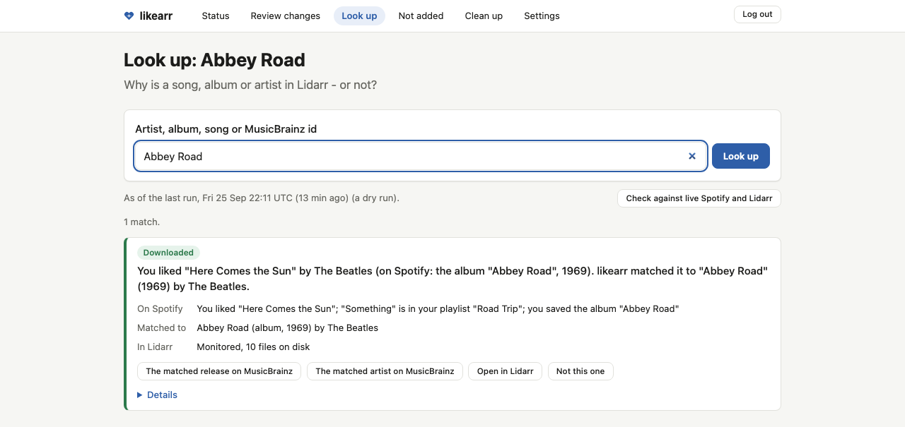

# likearr

Mirror your Spotify follows, saved albums and Liked Songs into Lidarr - and nothing else.

Not affiliated with Spotify or Lidarr.

Lidarr's own Spotify import lists can add, but they can't express *how much* of an artist you
want, they can't read Liked Songs, and when their token dies they fail silently. likearr reads
Spotify directly, works out exactly which MusicBrainz release groups your library should want, and
sets Lidarr's monitoring to match. Unfollow an artist or un-like a song and the matching releases
are unmonitored again. A run never unmonitors anything you monitored by hand.

likearr is a self-hosted service - one container, managed in the browser. It checks Spotify on a
schedule and sets Lidarr's monitoring to match; a CLI is there underneath for first-time setup,
hand work and scripting.

> Status: beta. The scope and safety model below are settled; defaults such as Clean up's may
> still change before 1.0, once more people have run it. Expect rough edges; read the safety
> model before pointing it at a library you love.

## Screenshots







Taken from a demo library seeded from well-known public artists, not a real listener's account -
see [`scripts/demo_state.py`](scripts/demo_state.py).

## Is this for you?

**For you:**
- Your Spotify follows, saved albums and Liked Songs, mirrored into a Lidarr you already run.
- You want the exact releases you like monitored, not whole discographies.
- A household with several Spotify accounts: run one instance per person against the same Lidarr,
  all on one Spotify developer app - see
  [More than one Spotify account](#more-than-one-spotify-account).

**Not for you:**
- Playlists you neither own nor collaborate on - only those two kinds can be a source; see
  [What can't be synced](#what-cant-be-synced).
- Downloading or searching - that's still Lidarr and your indexers, see
  [Getting the music downloaded](#getting-the-music-downloaded).

See [Scope](#scope) for the full statement of what likearr does and does not do.

## Requirements

- A host that can run Docker.
- Lidarr 2.x or 3.x (`SUPPORTED_MAJORS` in `likearr/adapters/lidarr.py`; anything else is refused).
- One Spotify Premium account that owns a free developer app in Development Mode (one-time setup -
  see [`docs/spotify.md`](docs/spotify.md)). Up to five people's accounts can use that one app -
  see [More than one Spotify account](#more-than-one-spotify-account).

## More than one Spotify account

Yes: a household with several Spotify accounts runs one likearr instance per account, sharing one
Spotify developer app and one Lidarr. A single instance still reads only one account - there's no
way to point it at two.

| | Shared across instances | Each instance keeps its own |
|---|---|---|
| Spotify | The developer app | Account, Connect flow and token |
| Lidarr | One install, one library | - |
| likearr | - | `/data` directory (state database, token file, `config.toml`), UI password, port |

See [docs/DEPLOY.md, "Running more than one instance"](docs/DEPLOY.md#running-more-than-one-instance)
for the allowlist steps, the compose setup, the one-app-vs-an-app-per-person tradeoffs (quota,
Premium), and what a shared Lidarr means for `adopt` and Clean up.

## Quick start

No clone needed. This is the smallest install: one service, `likearr` itself, no `likearr-cli` -
see [`docs/DEPLOY.md`, "Docker Compose"](docs/DEPLOY.md#docker-compose) for the difference and for
copying the full [`deploy/compose.example.yaml`](deploy/compose.example.yaml) instead if you want
`likearr-cli` (for hand commands), a second instance, or secrets kept in a file from the start.

Prefer secrets in a file over inline values? Skip the `environment:` block below: use
`env_file: [.env]` instead and fill in [`deploy/env.example`](deploy/env.example) as `.env` next to
`compose.yaml`. Otherwise, paste this as `compose.yaml` (or into an existing stack) and fill in the
values directly:

```yaml
services:
  likearr:
    image: ghcr.io/sysdad/likearr:0.5.0
    environment:
      LIKEARR_LIDARR_URL: "http://lidarr:8686"              # how this container reaches Lidarr
      LIKEARR_LIDARR_API_KEY: "<your lidarr api key>"       # Lidarr Settings -> General -> Security
      LIKEARR_SPOTIFY_CLIENT_ID: "<your spotify client id>" # developer.spotify.com/dashboard - see docs/spotify.md
      LIKEARR_UI_PASSWORD: "<16+ random characters>"        # e.g. `openssl rand -base64 24`
      # Optional: host names you browse to likearr by, comma-separated. Unset, it answers to
      # any IPv4 address (http://192.168.1.20:8770) but to no host name.
      # LIKEARR_ALLOWED_HOSTS: "likearr.example.org"
      # Optional: an email or URL MusicBrainz can reach you at. Unset, likearr's project URL.
      # LIKEARR_MUSICBRAINZ_CONTACT: "you@example.org"
    volumes:
      - ./likearr-data:/data
    ports:
      - "8770:8770"
    mem_limit: 768m
    stop_grace_period: 30m
    restart: unless-stopped
```

Now start it:

```bash
docker compose up -d
```

There is no config file to write first: on a first start with an empty `likearr-data`, likearr
writes `likearr-data/config.toml` itself, from
[`deploy/config.example.toml`](deploy/config.example.toml), and everything left to set is set in
the browser. `docker ps` shows the container as healthy once the config loads, even before the
first run writes the state database (see [`docs/DEPLOY.md`, "Running it"](docs/DEPLOY.md#running-it)). If it comes
up unhealthy instead, `./likearr-data` is very likely not writable by the container - see
[`docs/DEPLOY.md`, "Docker Compose"](docs/DEPLOY.md#docker-compose) for the writability
requirement (including a NAS or root-run host's uid mismatch) and the `chown` fix.

Open `http://<host>:8770` and log in with `LIKEARR_UI_PASSWORD`. From here on, first-time setup
and day-to-day use - connecting Spotify, setting up Lidarr, reading a plan, applying it, settings,
scheduling - are all in the browser:

- **Settings -> Connect Spotify.** Approve access on Spotify's page, then paste back the address it
  sends you to (it will fail to load - that's expected). If `[ui] public_url` is set to an
  `https://` address, Spotify instead sends you straight back with no copy/paste.
- **Settings -> Preview Lidarr setup**, then **Apply** (behind a confirm). Creates the Lean and
  Full metadata profiles, the `likearr` tag, and safe root-folder defaults - and says so first,
  without changing anything until you confirm. The same section is where you pick the root folder
  and quality profile likearr adds artists with, from Lidarr's own lists (a Lidarr with only one
  root folder has it picked for you). Until both are set, Status says so and no run plans.
- **Settings -> Doctor -> Run checks** is a read-only check of config, Lidarr, MusicBrainz and
  Spotify - useful any time, and works even before the first run or with a broken config.toml.
- **Review changes -> Check for changes**, read the plan, then **Apply** it. That first apply is
  always yours: the schedule is on from the start, but scheduled runs (and Status's "Run and apply
  now") wait for your first reviewed apply. Until then each one changes nothing, and Status says
  "Scheduled runs start after your first reviewed apply".

For a normal setup, nothing further is needed from a terminal. Prefer a terminal, want to script
it, or the box has no browser handy? Those three steps need the `likearr-cli` service, which isn't
in the minimal block above - copy the full
[`deploy/compose.example.yaml`](deploy/compose.example.yaml) (or add that service to what you
already have), then see [`docs/DEPLOY.md`](docs/DEPLOY.md) for the equivalent terminal commands
("First run: authenticate with Spotify", "Sanity check: doctor" and "Lidarr setup: profiles, tag,
root folder"), the rest of the install (Docker without Compose, or from source on bare metal) and
the env var reference, and [`docs/spotify.md`](docs/spotify.md) for the Spotify developer app you
need to create - including which redirect URI to register.

The first check reads every song through MusicBrainz at 1 request per second, so with an empty
cache it can take several hours for a few thousand songs. Later checks take minutes, since a song
already resolved stays cached. Cancelling or restarting keeps what it has already looked up, so
let it finish.

## Safety model

likearr is built to be wrong in the safe direction:

- **Nothing changes without a plan.** A run plans first. What you apply is exactly the plan you
  reviewed, and it is refused if Spotify, Lidarr or your rules changed since.
- **It only unmonitors what it monitored.** likearr records every release it monitors and a run
  never unmonitors anything else. It never deletes a file. See
  [Changing things in Lidarr by hand](#changing-things-in-lidarr-by-hand) for what happens when you
  disagree with it.
- **A bad read never looks like un-liking.** A failed or partial Spotify read unmonitors nothing,
  and a source or artist that suddenly shrinks is held back until you accept it.
- **Scheduled runs are capped.** At most 100 unmonitors per run by default.
- **It won't guess an artist.** Artists are matched by MusicBrainz's link to the Spotify page, not
  by name. When two artists share a name it reports the clash instead of adding the wrong one.
- **It never monitors a stranger's album.** A different credit is accepted only when MusicBrainz
  records the two artists as related.
- **It never searches or downloads.** Lidarr and your existing tools do that - see
  [Getting the music downloaded](#getting-the-music-downloaded).
- **Every run records its health**, to stdout and the run history, and to MQTT or a webhook if you
  set one up, so a silent failure shows. Dry runs publish to stdout only.
- **Clean up moves files, never deletes them.** Files go to a holding folder you empty yourself,
  and only after checks that the move is safe.

### What likearr writes

Everything likearr changes in Lidarr and Spotify. A scheduled run, and a plan you apply from
Review changes, never does the lines marked *by hand*.

**Changes in Lidarr**

- Adds artists with nothing monitored and no search, tagged `likearr`.
- Monitors releases a source wants, and unmonitors only releases it monitored.
- Sets "Monitor New Albums" to None on artists holding a release likearr owns (one it added,
  claimed or adopted), and on any artist it re-monitors or moves to the Full profile, including
  artists you added yourself, so Lidarr never auto-monitors a release no source asked for. An
  artist whose wanted releases you already monitor keeps its setting. likearr never sets it back.
- Re-monitors an artist you unmonitored if it holds a release a source wants.
- Moves an artist from the Lean to the Full metadata profile when a wanted release needs it
  (never back).
- Asks Lidarr to refresh an artist (`RefreshArtist`) it just added or widened, or one with a new
  release Lidarr's catalogue does not have yet.
- Creates the Lean and Full metadata profiles and the `likearr` tag when they are missing, and never
  overwrites one that exists.
- *By hand*, Settings' Lidarr setup (after a confirm) or `setup-profiles --apply`: the same
  profiles and tag, plus the root folder, created or with its defaults set so new artists monitor
  nothing.
- *By hand*, `adopt --apply`, once, from a plan you read: takes over the releases a source wants,
  keeps the ones on your keep list, and unmonitors every other monitored release.
- *By hand*, Clean up's `prune-stage --apply`: moves files to a holding folder, removes the Lidarr
  artists left with nothing (files kept, no import list exclusion), and asks Lidarr to rescan the
  rest. Never deletes a file.

**Changes in Spotify**

- Nothing, except *by hand* with `promote-save --apply`, from a plan you read: it follows artists
  and saves albums. Signing in asks Spotify to read only; the write access `promote-save` needs is
  asked for only when you opt in (see [Scopes](#scopes-and-when-you-have-to-re-authorize)).

**Never**

- Searches or downloads, deletes a file, changes the quality profile of an artist already in
  Lidarr, or unmonitors a release it did not monitor (outside the `adopt` plan you review).

The full rules, with every guard and exit code, are in
[`docs/dev/DESIGN.md`](docs/dev/DESIGN.md#safety).

## Using likearr

`likearr start` (the image's default `CMD`) is the whole service: web UI, in-service scheduler and
job runner, behind one password. Every run - scheduled or started from the UI - is a child process
of the same CLI described below.

| Page | What it's for |
|---|---|
| **Status** | Health in plain words, the last and next scheduled run (with a "Run and apply now" button), and what the last applied run changed, by name. |
| **Review changes** | Start a dry run, read the plan in plain language (what gets added, monitored, unmonitored and why), then apply exactly that plan. |
| **Look up** | Why a song, album or artist is monitored, waiting, left out or unmatched, answered instantly from the last run. |
| **Not added** | What couldn't be added, split by reason: not on MusicBrainz, not in Lidarr's catalogue yet, two artists share a name, left out by your settings, waiting for an album. |
| **Settings** | Connect or re-authorize Spotify; preview and apply Lidarr's setup (metadata profiles, tag, root folder); `[rules]`, `[guards]`, which Spotify sources to read, playlist choices, and the schedule (cron line and timezone) with pause/resume and a live preview of the next few fires. The cron expression can't fire more often than every 60 minutes. Clean up's switch is under Advanced, at the bottom. |

A fire missed while the service was down is caught up once, five minutes after it starts back up -
never once per fire missed. Pausing the schedule (Settings) stops scheduled runs and Run now
completely, with no Spotify, MusicBrainz or Lidarr call - but it never touches a plan you review
and apply yourself from Review changes; that always runs, paused or not.

The web UI never runs anything with `--force`, and never applies Clean up's file moves or Spotify
changes: it previews them and gives you the commands to run in a terminal (see
[what likearr writes](#what-likearr-writes)).

### Optional: Clean up

Clean up is **off by default**. It reviews the albums on disk that nothing on Spotify asks for:
you decide per artist and per album what to keep and what to trash, and it exports those
decisions. The file moves themselves stay a deliberate by-hand CLI step (`prune-stage`), which
Clean up hands you the exact command for after its previews, and following artists or saving
albums on Spotify is `promote-save`, also by hand.

Carrying it out needs more setup than the rest of likearr: the library mounted at Lidarr's exact
path in the `likearr-cli` container, and a holding folder on the same filesystem, outside the
library (see [`docs/DEPLOY.md`](docs/DEPLOY.md)). Turn it on in Settings > Advanced, or with
`[prune] enabled = true` in `config.toml`; that adds Clean up to the menu and the "Also let
promote-save follow artists and save albums" box to Settings. Turning it off hides both again and
forgets nothing: past decisions and earlier reviews stay where they are. The CLI commands
(`prune-report`, `prune-stage`, `prune-checks`, `promote-save`) run either way, and say so when
Clean up is off.

## Getting the music downloaded

likearr decides what's wanted and monitors it in Lidarr. It never searches for or downloads
anything itself.

- A release that comes out after likearr monitors it is usually grabbed by Lidarr on its own, as
  your indexers post it to their RSS feeds.
- An album that's already out needs a search. Lidarr doesn't search its own backlog on a schedule,
  so a monitored back-catalogue album can sit unmatched until something searches for it. Three
  ways to do that:
  - Lidarr's own Wanted > Missing > Search All, for a one-off catch-up.
  - A scheduled missing-album search through Lidarr's API (the `MissingAlbumSearch` command), if
    you want it to happen on its own.
  - A companion tool such as [Soularr](https://github.com/mrusse/soularr), which works from
    Lidarr's wanted list.
- Pace it. Searching hundreds of albums at once hits your indexers hard and risks a ban or a
  jammed queue - spread a first Search All out after a big apply rather than firing it all at once.

## What it monitors

| You did this on Spotify | Lidarr monitors |
|---|---|
| Followed an artist | Their studio **albums and EPs**, present and future. No singles, remixes, live albums, compilations or DJ mixes. |
| Saved an album | That album, whatever type it is. |
| Liked a song | With `liked_track_scope = "album"` (default): the studio album or EP the song lives on. If Spotify points at the single, likearr finds the album; if the album isn't out yet it waits, and after 180 days it monitors the single. With `"smallest"`: the smallest studio release holding the song, single first, unless you also follow the artist (then the album, which the follow already monitors). |
| Added a song to a playlist you own or collaborate on | Same as a liked song. Only playlists you **own or collaborate on** - see [What can't be synced](#what-cant-be-synced). |
| Added an artist in Lidarr yourself | Nothing new. What you monitored there stays monitored. Once a source wants one of its releases, likearr monitors that one and can change artist-level settings: see [what likearr writes](#what-likearr-writes). |

Liked songs map to the album they live on, with opt-outs for box sets, remix EPs and a deny list,
and a credit-relationship check for when MusicBrainz files a record under a different artist name
than Spotify; the exact rules are in [`docs/dev/DESIGN.md`](docs/dev/DESIGN.md).

## What can't be synced

Spotify's Development Mode only returns playlist items for playlists you own or collaborate on.
Followed playlists, other people's playlists, and Spotify's own playlists (Discover Weekly,
Release Radar, Daily Mix, and editorial playlists like Rap Caviar) all come back empty from the
API - likearr can't read what's on them, no matter how the playlist reaches your config.

A playlist you collaborate on works like one you own, once Spotify has been connected with
collaborative access (`playlist-read-collaborative`). likearr asks for it from this version on;
if you connected before, re-authorize once (Settings' "Re-authorize Spotify", or `likearr auth`)
and refresh the playlist list. Until then everything else keeps syncing as it is, and Settings and
Status say to re-authorize.

The playlist picker in Settings shows every playlist your account can see. Anything likearr can't
read is greyed out with the reason and can't be selected:
Spotify doesn't share this playlist's songs with a personal app. A playlist you collaborate on
says to re-authorize instead, until you have.

**Workaround:** like the songs you want, or copy them into a playlist you own (a running
"Discover keepers" playlist, say). Either one is a source likearr already reads.

## Changing things in Lidarr by hand

You will disagree with likearr sometimes, and the first thing to reach for is Lidarr's own
Monitor toggle. Two of those hand edits are undone on the next run.

**You don't want a release likearr monitored.** Unmonitoring it in Lidarr is undone on the next
run, as long as a source still wants it. Use **Not this one** on the plan row or on the Look up
card instead, or unlike the song on Spotify. Not this one works for releases wanted by liked or
playlist songs and by a followed artist's catalogue. A saved album always wins, so for one of
those the button is not offered and the row says to unsave the album on Spotify instead.

**You don't want Lidarr searching an artist.** Unmonitoring the artist is undone while likearr
still wants any of their releases, because Lidarr never searches an unmonitored artist's albums.
The routes are Spotify (unfollow the artist, unlike their songs, unsave their albums) or Not this
one on each release. The albums-only tag does not help here either: it narrows a followed
artist's monitoring to studio albums, it does not stop likearr wanting them.

**You want to keep a release after you unlike it.** Let likearr unmonitor it, then monitor it
again in Lidarr by hand. From then on it is yours and likearr leaves it alone.

## Scope

One Spotify account into one Lidarr, per instance. likearr reads followed artists, saved albums,
Liked Songs and playlists you own or collaborate on, works out what your library should want, and
sets Lidarr's monitoring to match - on a schedule or on demand, with a plan you review before it applies.

It never searches or downloads. It only unmonitors what it monitored, and Clean up moves files
rather than deleting them. It writes to Spotify only when you run `promote-save --apply` yourself.
See [Safety model](#safety-model) for the full list.

likearr sets Lidarr's monitoring; getting the files is Lidarr's own missing-album search or a tool
like Soularr - see [Getting the music downloaded](#getting-the-music-downloaded).

**Not planned:** one instance reading several Spotify accounts. Households are supported with one
instance per account - see [More than one Spotify account](#more-than-one-spotify-account). Also
not planned: likes from Deezer, Tidal, YouTube Music, Apple Music, Qobuz, Plex or Navidrome.

**Possible later:** ListenBrainz loved tracks.

## CLI

The service runs the same CLI underneath. First-time setup, the by-hand steps (`prune-stage --apply`,
`promote-save --apply`) and scripting use it directly: see [`docs/CLI.md`](docs/CLI.md).

## Spotify Development Mode

Any app you create yourself runs under Spotify's Development Mode rules (February 2026 onward):

- Playlist contents are returned **only for playlists you own or collaborate on**. Followed,
  other people's, and Spotify's own algorithmic and editorial playlists all come back empty;
  likearr refuses them loudly rather than treating them as empty. See
  [What can't be synced](#what-cant-be-synced).
- The app owner needs Spotify Premium. Quota is shared across all your apps, and it is small: a
  burst of ~700 `search` calls from an ad-hoc script hit `QUOTA_EXCEEDED` on a fresh app. A normal
  likearr run stays well under, but don't run probes against the same client id in the same window.
  Every run, dry or not, reads every source: a day of back-to-back verification dry runs is enough
  to exhaust it, and then every run aborts with zero unmonitors until it recovers. Space them out.
- `external_ids` (ISRC/UPC) were removed and then restored in 2026. likearr treats them as helpful,
  not required, and falls back to name lookups through MusicBrainz and Lidarr.

### More than one person

The app owner's Premium requirement above is per developer app, not per person it reads for -
see [More than one Spotify account](#more-than-one-spotify-account) for how a household shares one
app across up to five accounts, and
["Running more than one instance"](docs/DEPLOY.md#running-more-than-one-instance) for the
allowlist, the setup and what a shared Lidarr means for `adopt` and Clean up.

### Scopes, and when you have to re-authorize

Signing in is read-only by default: likearr asks for `user-follow-read user-library-read
playlist-read-private playlist-read-collaborative`, which is all it needs to mirror your likes and
your own and collaborative playlists into Lidarr. The write scopes,
`user-follow-modify user-library-modify`, are only for `promote-save` (Clean up's follow and save
on Spotify), and likearr asks for them only when you opt in: `likearr auth --promote-save`, or the
"Also let promote-save follow artists and save albums" box in Settings before you connect (shown
once Clean up is on).

Spotify grants scopes when you approve the consent screen and a token refresh **never widens
them**, so a read-only token cannot write. `promote-save` checks up front and refuses with the fix
rather than failing halfway through:

```
likearr auth --manual --promote-save -c config.toml     # approve write access, then re-run promote-save
```

A plain re-authorization (Settings' "Re-authorize Spotify", or `likearr auth` without the flag)
keeps what you have: if your current token already has the write scopes, it asks for them again;
if not, it stays read-only. Every other command works on a read-only token.

A token from before likearr asked for `playlist-read-collaborative` keeps working for everything it
did before, scheduled runs included: nothing checks for the new scope except the playlist picker,
which offers a playlist you collaborate on only once your token has it. Re-authorize when you want
one; a token with the write scopes keeps them.

## Why not Lidarr's import lists?

Lidarr's metadata profile is per *artist*, not per *source*. It can't say "albums and EPs for the
artists I follow, but only this one single I liked". It has no Liked Songs list. And its lists go
through a shared auth proxy whose token can die without a health warning. likearr keeps Lidarr as
the library manager and moves the *intent* out to where it can be expressed.

If you move to likearr, disable Lidarr's own Spotify import lists first, especially before a
Clean up: they re-add every artist you just removed, monitored, and RSS downloads them again.

## Design

Functional core, imperative shell. Sources produce an immutable snapshot; a pure resolver turns it
into a desired state; a pure diff compares that with Lidarr and the ownership state; only the apply
step has side effects, in per-batch SQLite transactions. Details, diagrams and the failure model:
[`docs/dev/DESIGN.md`](docs/dev/DESIGN.md).

## Development

Dev setup, the check commands and the contribution rules are in
[`CONTRIBUTING.md`](CONTRIBUTING.md).

## Changelog

Notable changes are recorded in [`CHANGELOG.md`](CHANGELOG.md).

## Security

To report a vulnerability, or to see the intended exposure model, see [`SECURITY.md`](SECURITY.md).

## Licence

MIT.
